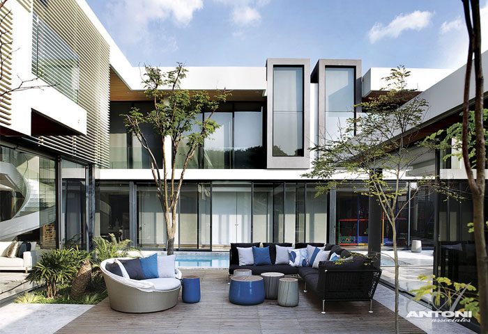
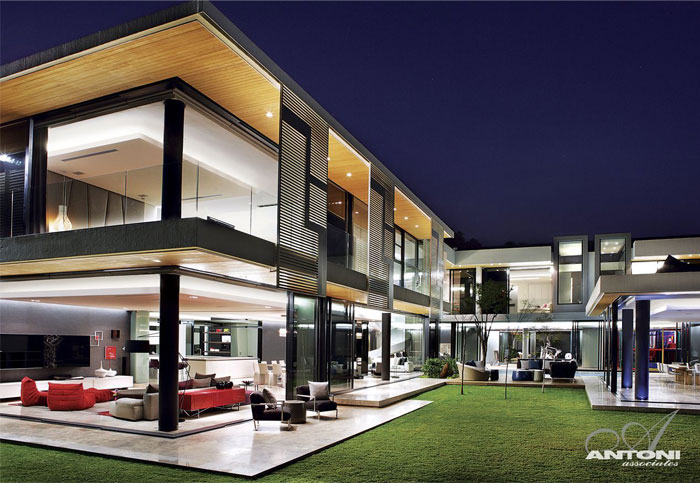
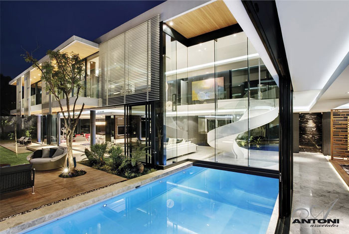
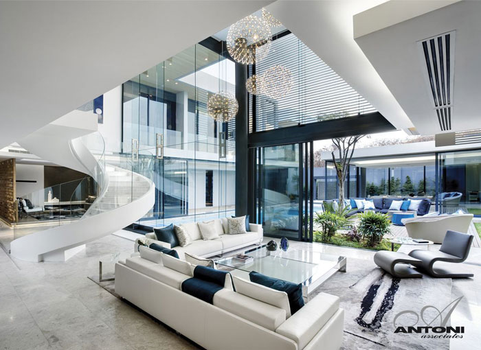
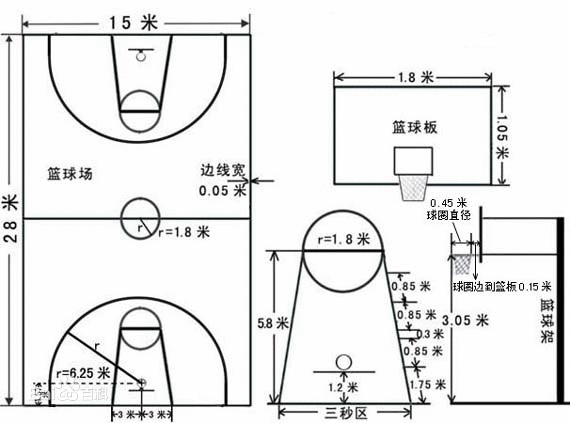
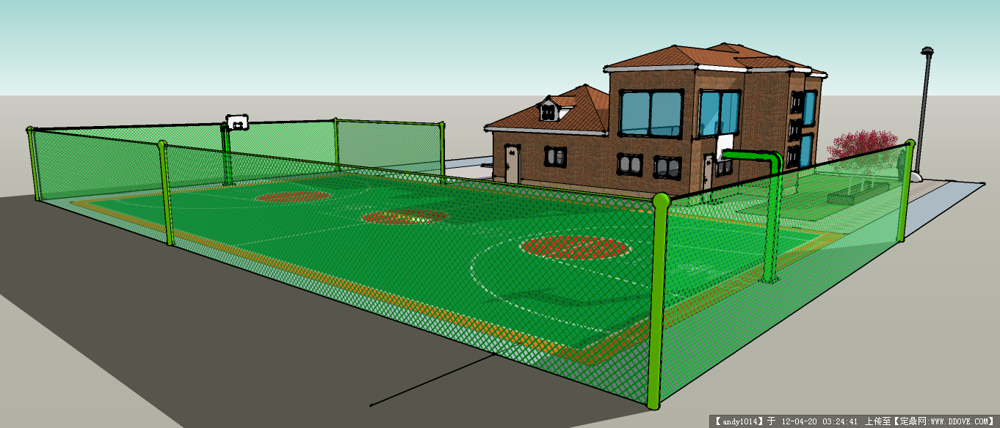

# Morden Villas

DD作为主导的现代化别墅构建记录(inspirations, tricks)

## Contents
- [Meetings](#meetings)
- [Pre-images](#pre-images)
- [Budget](#budget)
- [Financing](#financing)
- [Basketball](#basketball)

## Meetings
记录每次会议内容与结论，下一次会议大体时间

### 会议一 @ 20190608
参与者：dgh, djj, dd
- [ ] 需要一个地下库，存放农具杂物？

## Pre-images
前期调研图片，图片命名格式：图片类型-调研者-方案序号-方案内的图片序号(e.g. research-dd-01-1.jpg -> dd调研的第一套方案之图片一)

### 方案选定
- [ ] research-dd-01

### 前期调研图片 - 方案01 - by dd

## Budget
项目预算，包括建造和装修

### 建造
- <=300,000￥

### 装修
- around 300,000￥

## Financing
- dgh: 200,000￥
- djj: 200,000￥
- dd: 200,000￥

## Basketball

